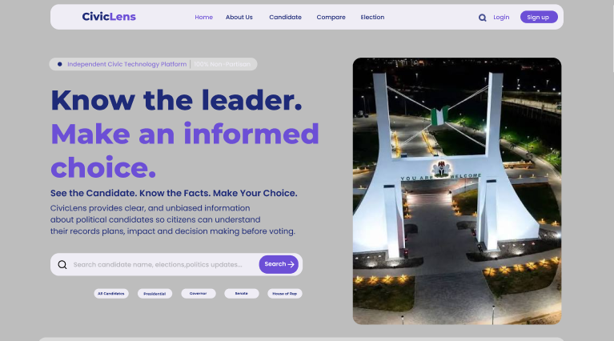
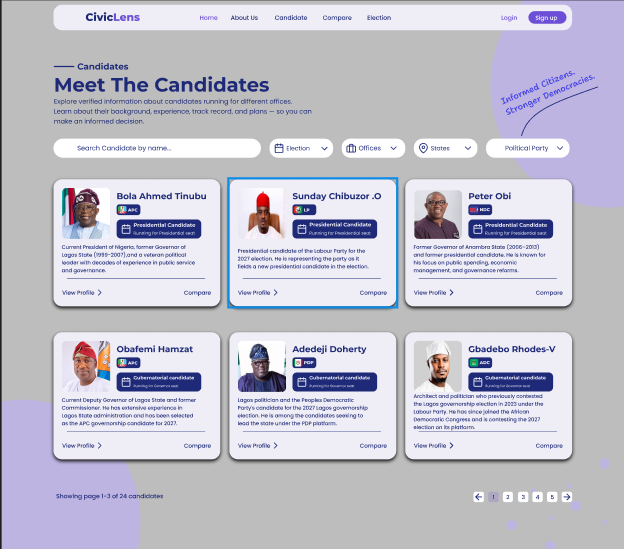

# CivicLens

### Know Your Leader

CivicLens is a digital platform designed to help users discover, understand, and compare information about political leaders before making informed decisions.

## 🎯 Project Overview

Finding clear and organized information about political leaders can be difficult.

CivicLens aims to bring relevant information about leaders and elections into one accessible platform, helping users explore information in a simple and understandable way.

## ✨ Features

- 👤 Leader profiles
- 🗳️ Upcoming elections
- 🔎 Candidate information
- ⚖️ Candidate comparison
- 📰 Latest updates
- 📚 Background and experience
- 📱 User-friendly interface

### 📸 Preview

The project was developed using user research, information architecture, user flows, and UI/UX design principles.

## 🛠️ Technologies

- Figma
- HTML
- CSS
- JavaScript

- ## 🔗 Project Links

- 🎨 Figma Design — Coming soon
- 🌐 Live Demo — Coming soon

## 🚧 Project Status

**In Development**

More features and improvements are currently being worked on.

## 👨🏽‍💻 Developer

**Samuel Oyindamola**

Software Developer + UI/UX Designer
